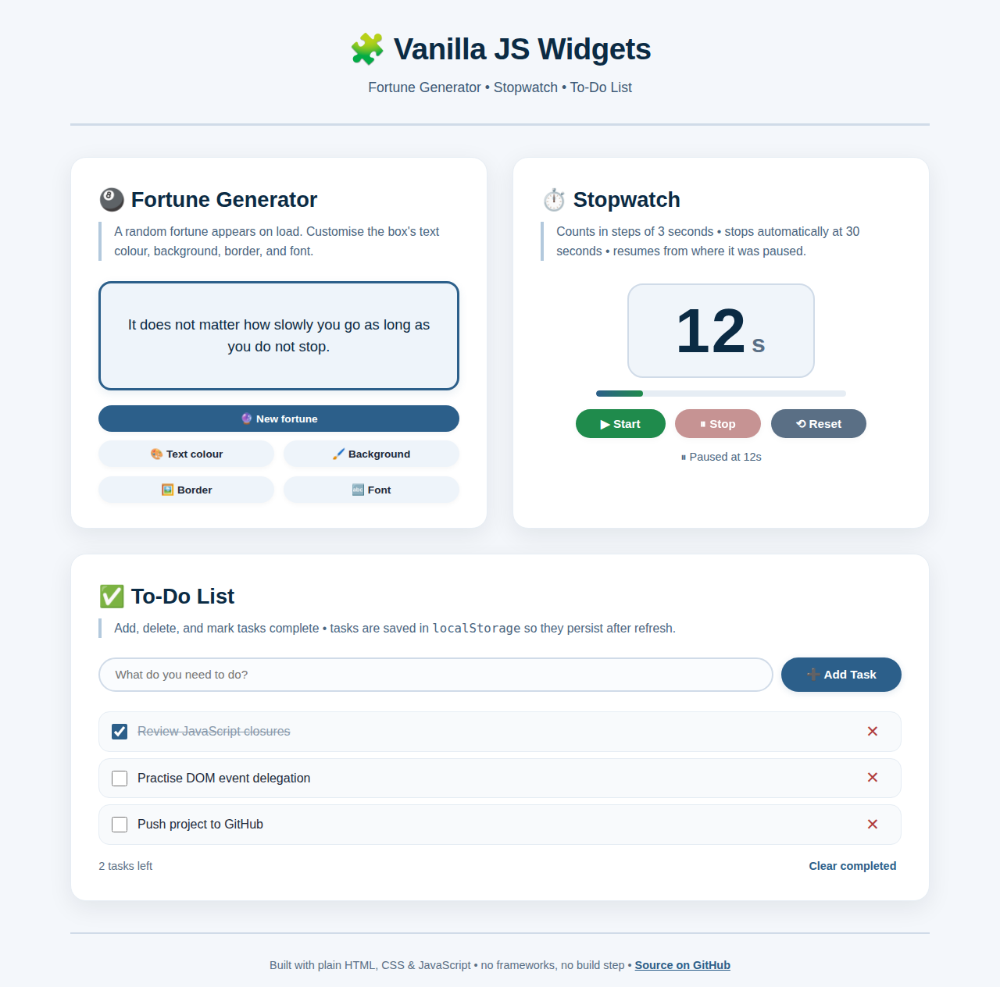

# 🧩 Vanilla JS Widgets

Three small interactive widgets (a **fortune generator**, a **stopwatch** and a **to-do list**) built with plain HTML, CSS and JavaScript. No frameworks, no libraries, no build step.

**[▶ Live demo](https://sandipkumarpaul.github.io/vanilla-js-widgets/)**



## Features

### 🎱 Fortune Generator
- Shows a random fortune on page load. **New fortune** picks another one and never repeats the current fortune.
- Four buttons cycle the fortune box's **text colour**, **background colour**, **border colour** and **font size + family** through preset palettes.

### ⏱️ Stopwatch
- Counts up in **3-second steps** and **stops automatically at 30 seconds**.
- **Stop** pauses the count and **Start** resumes it from the same value. **Reset** returns to 0.
- Buttons enable and disable to match the current state, and a progress bar shows how close the count is to the 30-second limit.

### ✅ To-Do List
- Add tasks with the button or the **Enter** key. Tick a task to mark it complete, or delete it.
- Shows a live "tasks left" counter and a **Clear completed** action.
- Tasks are saved to **`localStorage`**, so they survive a page refresh. Corrupt or unavailable storage is handled without crashing.

## Implementation notes

- Each widget is its own self-contained [IIFE](https://developer.mozilla.org/en-US/docs/Glossary/IIFE) in `js/`, so no variables leak into the global scope.
- The to-do list builds its items with DOM APIs (`createElement` / `textContent`), never raw HTML strings, which keeps user input safe from XSS. It uses **event delegation**: one listener on the list handles every task.
- The stopwatch runs on `setInterval` / `clearInterval`, and a single `render()` function keeps the display, progress bar and button states in sync.
- The layout is responsive: a two-column CSS Grid on desktop, stacking to one column on small screens.
- Accessibility basics: labelled form controls, `aria-live` regions for changing content, and visible keyboard focus styles.

## Project structure

```
vanilla-js-widgets/
├── index.html        # Page markup
├── css/
│   └── style.css     # All styles (layout, components, responsive rules)
├── js/
│   ├── fortune.js    # Fortune Generator
│   ├── stopwatch.js  # Stopwatch
│   └── todo.js       # To-Do List (localStorage persistence)
└── docs/
    └── screenshot.png
```

## Running locally

No installation is needed. Clone the repo and open `index.html` in any modern browser:

```bash
git clone https://github.com/sandipkumarpaul/vanilla-js-widgets.git
cd vanilla-js-widgets
open index.html        # macOS  (Windows: start index.html, Linux: xdg-open index.html)
```

## Background

This started as a university web programming assignment on core JavaScript: arrays, timers, DOM manipulation and `localStorage`. I later cleaned it up for my portfolio.

## License

[MIT](LICENSE)
